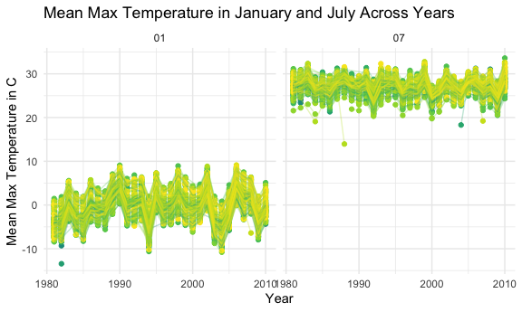
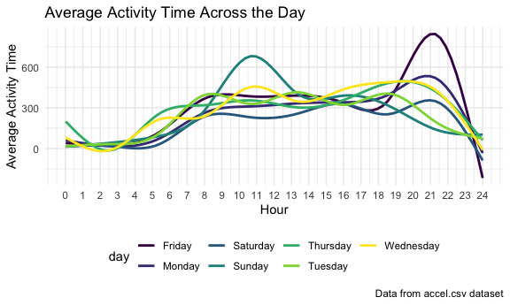
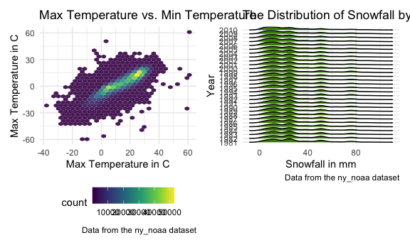

p8105_hw3_jl6321.Rmd
================

## Problem 1

(corrected answer after checking the posted solution)

Read in the data

``` r
data("instacart")

instacart = 
  instacart %>% 
  as_tibble(instacart)
```

There are 1384617 rows and 15 columns, where fresh vegetables and fresh
fruits holding the most ordered items.

``` r
instacart %>% 
  count(aisle) %>% 
  arrange(desc(n))
```

    ## # A tibble: 134 × 2
    ##    aisle                              n
    ##    <chr>                          <int>
    ##  1 fresh vegetables              150609
    ##  2 fresh fruits                  150473
    ##  3 packaged vegetables fruits     78493
    ##  4 yogurt                         55240
    ##  5 packaged cheese                41699
    ##  6 water seltzer sparkling water  36617
    ##  7 milk                           32644
    ##  8 chips pretzels                 31269
    ##  9 soy lactosefree                26240
    ## 10 bread                          23635
    ## # … with 124 more rows

Make a plot that shows the number of items ordered in each aisle.

``` r
instacart %>% 
  count(aisle) %>% 
  filter(n > 10000) %>% 
  mutate(aisle = fct_reorder(aisle, n)) %>% 
  ggplot(aes(x = aisle, y = n)) + 
  geom_point() + 
  labs(title = "Number of items ordered in each aisle") +
  theme(axis.text.x = element_text(angle = 60, hjust = 1))
```



Make a table showing the three most popular items in each of the aisles
“baking ingredients”, “dog food care”, and “packaged vegetables fruits”.

``` r
instacart %>% 
  filter(aisle %in% c("baking ingredients", "dog food care", "packaged vegetables fruits")) %>%
  group_by(aisle) %>% 
  count(product_name) %>% 
  mutate(rank = min_rank(desc(n))) %>% 
  filter(rank < 4) %>% 
  arrange(desc(n)) %>%
  knitr::kable()
```

| aisle                      | product_name                                  |    n | rank |
|:---------------------------|:----------------------------------------------|-----:|-----:|
| packaged vegetables fruits | Organic Baby Spinach                          | 9784 |    1 |
| packaged vegetables fruits | Organic Raspberries                           | 5546 |    2 |
| packaged vegetables fruits | Organic Blueberries                           | 4966 |    3 |
| baking ingredients         | Light Brown Sugar                             |  499 |    1 |
| baking ingredients         | Pure Baking Soda                              |  387 |    2 |
| baking ingredients         | Cane Sugar                                    |  336 |    3 |
| dog food care              | Snack Sticks Chicken & Rice Recipe Dog Treats |   30 |    1 |
| dog food care              | Organix Chicken & Brown Rice Recipe           |   28 |    2 |
| dog food care              | Small Dog Biscuits                            |   26 |    3 |

Make a table showing the mean hour of the day at which Pink Lady Apples
and Coffee Ice Cream are ordered on each day of the week.

``` r
instacart %>%
  filter(product_name %in% c("Pink Lady Apples", "Coffee Ice Cream")) %>%
  group_by(product_name, order_dow) %>%
  summarize(mean_hour = mean(order_hour_of_day)) %>%
  spread(key = order_dow, value = mean_hour) %>%
  knitr::kable(digits = 2)
```

    ## `summarise()` has grouped output by 'product_name'. You can override using the
    ## `.groups` argument.

| product_name     |     0 |     1 |     2 |     3 |     4 |     5 |     6 |
|:-----------------|------:|------:|------:|------:|------:|------:|------:|
| Coffee Ice Cream | 13.77 | 14.32 | 15.38 | 15.32 | 15.22 | 12.26 | 13.83 |
| Pink Lady Apples | 13.44 | 11.36 | 11.70 | 14.25 | 11.55 | 12.78 | 11.94 |

## Problem 2

Read and tidy the data.

``` r
accel_df = 
  read_csv('./Data/accel_data.csv') %>% 
  pivot_longer( 
    activity.1:activity.1440, 
    names_to = "minute", 
    names_prefix = "activity.", 
    values_to = "activity_counts" 
  ) %>% 
  mutate(if_weekend = (day %in% c('Saturday', 'Sunday'))) %>% 
  relocate(if_weekend, .after = day_id)
```

    ## Rows: 35 Columns: 1443
    ## ── Column specification ────────────────────────────────────────────────────────
    ## Delimiter: ","
    ## chr    (1): day
    ## dbl (1442): week, day_id, activity.1, activity.2, activity.3, activity.4, ac...
    ## 
    ## ℹ Use `spec()` to retrieve the full column specification for this data.
    ## ℹ Specify the column types or set `show_col_types = FALSE` to quiet this message.

Variables in this dataset include week, day_id, if_weekend, day, minute,
activity_counts. There are 50400 observations in total.

Aggregate across minutes for each day and create a table.

``` r
accel_aggregate = accel_df %>%
  group_by(week, day) %>%
  summarise(total_activity = sum(activity_counts)) %>%
  pivot_wider(
    names_from = "day",
    values_from = "total_activity"
  ) 
```

    ## `summarise()` has grouped output by 'week'. You can override using the
    ## `.groups` argument.

``` r
accel_aggregated = accel_aggregate[, c(1, 3, 7, 8, 6, 2, 4, 5)]
accel_aggregated
```

    ## # A tibble: 5 × 8
    ## # Groups:   week [5]
    ##    week  Monday Tuesday Wednesday Thursday  Friday Saturday Sunday
    ##   <dbl>   <dbl>   <dbl>     <dbl>    <dbl>   <dbl>    <dbl>  <dbl>
    ## 1     1  78828. 307094.   340115.  355924. 480543.   376254 631105
    ## 2     2 295431  423245    440962   474048  568839    607175 422018
    ## 3     3 685910  381507    468869   371230  467420    382928 467052
    ## 4     4 409450  319568    434460   340291  154049      1440 260617
    ## 5     5 389080  367824    445366   549658  620860      1440 138421

There does not seem to be any apparent trend based on the table besides
that the total activities on the 4th and 5th Saturday tend to be low.

Make a single-panel plot.

``` r
accel_df %>% 
  mutate(minute = as.numeric(minute)) %>% 
  group_by(day, minute) %>% 
  summarize(mean_activity_counts = mean(activity_counts)) %>% 
  ggplot(aes(x = minute, y = mean_activity_counts, color = day)) + 
  geom_smooth(se = FALSE) + 
  labs( 
    title = "Average Activity Time Across the Day", 
    x = "Hour", 
    y = "Average Activity Time", 
    caption = "Data from accel.csv dataset") + 
  scale_x_continuous(breaks = c(0:24) * 60, labels = c(0:24))
```

    ## `summarise()` has grouped output by 'day'. You can override using the `.groups`
    ## argument.
    ## `geom_smooth()` using method = 'gam' and formula 'y ~ s(x, bs = "cs")'



According to the graph, we can conclude that there tends to be most
activity on average around 9pm on Friday and 11am on Sunday. The average
activity seems to be low from 11pm to 5am the next day.

## Problem 3

``` r
data("ny_noaa")
missing_data = sum(is.na(ny_noaa))
missing_rate = missing_data / (nrow(ny_noaa) * ncol(ny_noaa))
```

This dataset consists of 2595176 rows and 7 columns. The variables
include id, date, prcp, snow, snwd, tmax, tmin. The dataset possesses a
missing data rate of 0.1864791, which may be an issue because the
percentage is greater than 10%.

Clean the dataset.

``` r
ny_noaa_tidy = 
  ny_noaa %>%
  separate(date, into = c("year", "month", "day"), sep = "-") %>%
  mutate(
    prcp = as.double(prcp) / 10, 
    tmax = as.double(tmax) / 10, 
    tmin = as.double(tmin) / 10
  )
```

Find the most commonly observed snowfall value.

``` r
snowfall = 
  ny_noaa_tidy %>% 
  group_by(snow) %>%
  summarise(n_obs = n()) %>%
  arrange(desc(n_obs)) 
```

The most commonly observed value for snowfall is 0mm. Make a two-panel
plot showing the average max temperature in January and in July in each
station across years.

``` r
ny_noaa_tidy %>% 
  filter(month == "01" | month == "07") %>% 
  group_by(id, year, month) %>% 
  summarize(tmax_mean = mean(tmax, rm.na = TRUE)) %>% 
  ggplot(aes(x = as.integer(year), y = tmax_mean, color = id)) + 
  geom_point() + 
  geom_line(alpha = 0.3) +
  facet_grid(. ~ month) + 
  labs(
    title = "Mean Max Temperature in January and July Across Years", 
    x = "Year", 
    y = "Mean Max Temperature in C"
  ) + 
  theme(legend.position = "none")
```

    ## `summarise()` has grouped output by 'id', 'year'. You can override using the
    ## `.groups` argument.

    ## Warning: Removed 7058 rows containing missing values (geom_point).

    ## Warning: Removed 6007 row(s) containing missing values (geom_path).


The overall average max temperature in July is higher than that in
January. Compared with July, the average max temperature in January
seems to have a greater range. Some outliers exist, including one
datapoint in January of 1982 and one datapoint in July of 1988.

Make a two-panel plot showing: (i) tmax vs tmin for the full dataset
(ii) the distribution of snowfall values \> 0 and \< 100 separately by
year.

``` r
tmax_vs_tmin = 
  ny_noaa_tidy %>% 
  ggplot(aes(x = tmax, y = tmin)) + 
  geom_hex(alpha = 0.9) + 
  labs(
    title = "Max Temperature vs. Min Temperature", 
    x = "Max Temperature in C", 
    y = "Max Temperature in C", 
    caption = "Data from the ny_noaa dataset") 

snowfall_distribution = 
  ny_noaa_tidy %>% 
  filter(snow > 0 & snow < 100) %>% 
  ggplot(aes(x = snow, y = year)) + 
  geom_density_ridges(scale = 0.9, fill = 'chartreuse4') + 
  labs(
    title = "The Distribution of Snowfall by Year", 
    x = "Snowfall in mm", 
    y = "Year", 
    caption = "Data from the ny_noaa dataset"
  ) 

tmax_vs_tmin + snowfall_distribution 
```

    ## Warning: Removed 1136276 rows containing non-finite values (stat_binhex).

    ## Picking joint bandwidth of 3.76


