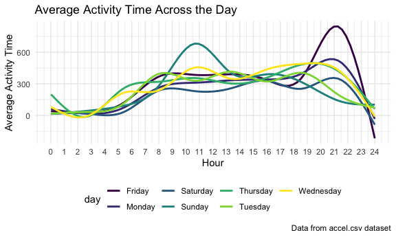

p8105_hw3_jl6321.Rmd
================

## Problem 2

Read and tidy the data.

``` r
accel_df = 
  read_csv('./Data/accel_data.csv') %>% 
  pivot_longer( 
    activity.1:activity.1440, 
    names_to = "minute", 
    names_prefix = "activity.", 
    values_to = "activity_counts" 
  ) %>% 
  mutate(if_weekend = (day %in% c('Saturday', 'Sunday'))) %>% 
  relocate(if_weekend, .after = day_id)
```

    ## Rows: 35 Columns: 1443
    ## ── Column specification ────────────────────────────────────────────────────────
    ## Delimiter: ","
    ## chr    (1): day
    ## dbl (1442): week, day_id, activity.1, activity.2, activity.3, activity.4, ac...
    ## 
    ## ℹ Use `spec()` to retrieve the full column specification for this data.
    ## ℹ Specify the column types or set `show_col_types = FALSE` to quiet this message.

Variables in this dataset include week, day_id, if_weekend, day, minute,
activity_counts. There are 50400 observations in total.

Aggregate across minutes for each day and create a table.

``` r
accel_aggregate = accel_df %>%
  group_by(week, day) %>%
  summarise(total_activity = sum(activity_counts)) %>%
  pivot_wider(
    names_from = "day",
    values_from = "total_activity"
  ) 
```

    ## `summarise()` has grouped output by 'week'. You can override using the
    ## `.groups` argument.

``` r
accel_aggregated = accel_aggregate[, c(1, 3, 7, 8, 6, 2, 4, 5)]
accel_aggregated
```

    ## # A tibble: 5 × 8
    ## # Groups:   week [5]
    ##    week  Monday Tuesday Wednesday Thursday  Friday Saturday Sunday
    ##   <dbl>   <dbl>   <dbl>     <dbl>    <dbl>   <dbl>    <dbl>  <dbl>
    ## 1     1  78828. 307094.   340115.  355924. 480543.   376254 631105
    ## 2     2 295431  423245    440962   474048  568839    607175 422018
    ## 3     3 685910  381507    468869   371230  467420    382928 467052
    ## 4     4 409450  319568    434460   340291  154049      1440 260617
    ## 5     5 389080  367824    445366   549658  620860      1440 138421

There does not seem to be any apparent trend based on the table besides
that the total activities on the 4th and 5th Saturday tend to be low.

Make a single-panel plot.

``` r
accel_df %>% 
  mutate(minute = as.numeric(minute)) %>% 
  group_by(day, minute) %>% 
  summarize(mean_activity_counts = mean(activity_counts)) %>% 
  ggplot(aes(x = minute, y = mean_activity_counts, color = day)) + 
  geom_smooth(se = FALSE) + 
  labs( 
    title = "Average Activity Time Across the Day", 
    x = "Hour", 
    y = "Average Activity Time", 
    caption = "Data from accel.csv dataset") 
```

    ## `summarise()` has grouped output by 'day'. You can override using the `.groups`
    ## argument.
    ## `geom_smooth()` using method = 'gam' and formula 'y ~ s(x, bs = "cs")'


